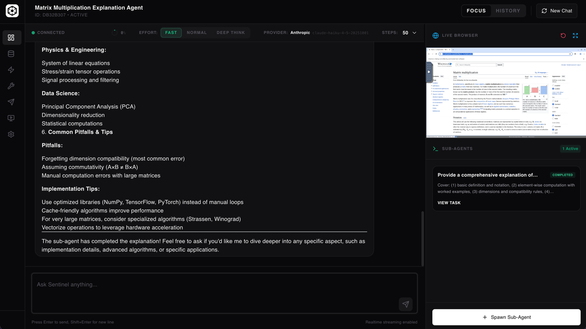
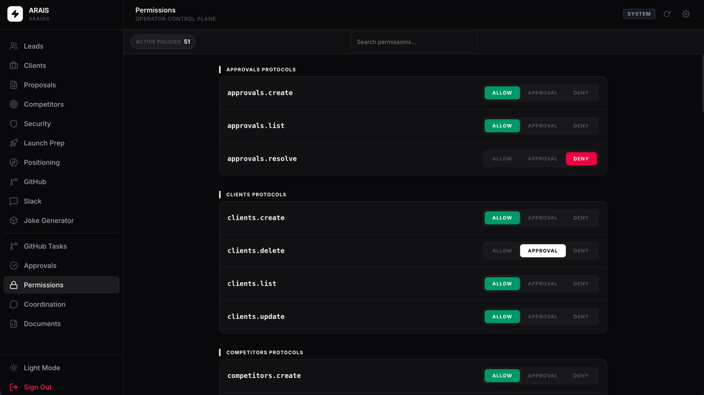

# Sentinel: Autonomous Agent Platform, Backed by araiOS

Sentinel is a complete operator platform for autonomous execution.
It combines a high-quality frontend, real runtime controls, browser automation, and structured memory into one cohesive stack you can run locally.

## Built by ARAIS

ARAIS designs and builds production AI systems.
Sentinel is our free stack for teams that want autonomous agents with real operational quality and strong user-facing execution.
Learn more: [arais.us](https://arais.us)

## Why Sentinel Feels Different

1. **It just works**  
No painful setup flow, no complex multi-service wiring, no fragile local boot choreography.

2. **Modern UI built for operators**  
Sentinel ships with a clean, fast interface and a built-in live browser monitor to watch agent execution in real time.

3. **Focused system, not bloated**  
The stack stays opinionated and practical, without piling on noisy tools or oversized prompt scaffolding.

4. **Hierarchical memory model**  
Memory is structured for continuity and scale, with a hierarchy that helps long-running autonomous work stay coherent.

5. **Custom Python agent runtime**  
Sentinel runs on custom agent code written in Python, giving teams direct control over execution behavior and task logic.

6. **araiOS tool creation + guardrails**  
araiOS lets users create custom tools, gate them with explicit controls, and expose safe capabilities to agents under operator-defined guardrails.

7. **Unified Triggers system**  
Webhooks, cron schedules, and scripts can all trigger agents from one UI, and agents can update trigger definitions when allowed.

8. **Python framework for embedded pipelines**  
Developers can build Python-native pipelines and embed agent workflows directly into code, similar in spirit to visual orchestrators but governed by Sentinel.

9. **No painful manual configuration culture**  
The platform is designed to avoid brittle hand-written config sprawl and keep teams moving with a reliable default runtime.

## Sentinel + araiOS

- `Sentinel` is the autonomous runtime and operator interface.
- `araiOS` is the operating layer for auth, permissions, approvals, and coordination.

Sentinel is the product focus. araiOS powers the surrounding control plane.

## Product Screens

### Sentinel Operator UI


### araiOS Workspace


## URLs

- `http://localhost:4747/` -> Login gateway + app chooser
- `http://localhost:4747/sentinel/` -> Sentinel
- `http://localhost:4747/araios/` -> araiOS
- `http://localhost:4747/vnc/` -> Live browser view

## Quick Start (Recommended)

### 1. Prerequisite

- Docker Desktop installed and running

### 2. Run the stack CLI

```bash
bash ./sentinel-cli.sh
```

Run this in a normal local terminal (interactive TTY).

The CLI menu lets you:
- create or edit an instance config
- start or stop an instance
- view global status across instances
- tail logs
- delete an instance (with volume cleanup)

Each instance is stored in `.instances/<instance>.env` and runs with an isolated Docker Compose project.

### 3. Sign in and choose app

1. Open the URL printed by the CLI (default: `http://localhost:4747/`)
2. Authenticate
3. Choose `Sentinel` or `araiOS`

### 4. Multiple local instances (supported)

To run multiple instances:

1. Open `bash ./sentinel-cli.sh`
2. Select `New/Edit Instance`
3. Create another instance name
4. Use a different gateway port when prompted

Instances are isolated by Compose project + env file, so they can run in parallel.

## Manual Start (Optional)

If you prefer manual setup:

```bash
cp .env.example .env
docker compose up --build
```

## Authentication and Onboarding

The gateway onboarding is auth-agnostic and routes users into one shared session model.

### Token Login (enabled by default)

- user enters `PLATFORM_BOOTSTRAP_API_KEY`
- gateway calls `/platform/auth/token`
- on first boot only, gateway finalizes bootstrap and rotates credentials:
  - generates one `admin` API key
  - generates one `agent` API key
  - revokes/deletes the bootstrap key
  - shows the two new keys once so the user can store them securely
- platform returns shared access + refresh JWTs
- both Sentinel and araiOS accept the same JWT
- if keys are lost after first-boot rotation, recovery is manual DB intervention

### OAuth Login (optional deployment mode)

- the same onboarding gateway can expose OAuth provider login when connected to your IdP/provider
- after OAuth identity is validated, it should issue the same shared JWT session model used by both apps

Note: this repository ships token-based onboarding out of the box.

## What You Get in This Repo

- `apps/backend/sentinel` -> Sentinel backend
- `apps/frontend/sentinel` -> Sentinel frontend
- `apps/backend/araios` -> araiOS backend + centralized auth
- `apps/frontend/araios` -> araiOS frontend
- `infra/` -> gateway and Docker wiring
- `docker-compose.yml` -> production-style local runtime
- `docker-compose.dev.yml` -> hot reload runtime for all four apps
- `docs/browser-roadmap.md` -> browser automation roadmap

## Operations

Primary operations are available in the CLI menu:

```bash
bash ./sentinel-cli.sh
```

Manual fallback commands for an instance:

```bash
docker compose --project-name sentinel-<instance> --env-file .instances/<instance>.env ps
docker compose --project-name sentinel-<instance> --env-file .instances/<instance>.env logs -f
docker compose --project-name sentinel-<instance> --env-file .instances/<instance>.env down
docker compose --project-name sentinel-<instance> --env-file .instances/<instance>.env down -v
```

## Development (Secondary)

```bash
docker compose -f docker-compose.dev.yml up --build
```

This starts hot reload for both frontends and both backends.

When switching between production-style and development compose files, run:

```bash
docker compose down --remove-orphans
```

## License

Licensed under GNU AGPL-3.0 ([LICENSE](LICENSE)).
Attribution and notices: [NOTICE](NOTICE).
Contribution process and DCO: [CONTRIBUTING.md](CONTRIBUTING.md).
Automated third-party inventory: run `bash scripts/generate-license-reports.sh`.
